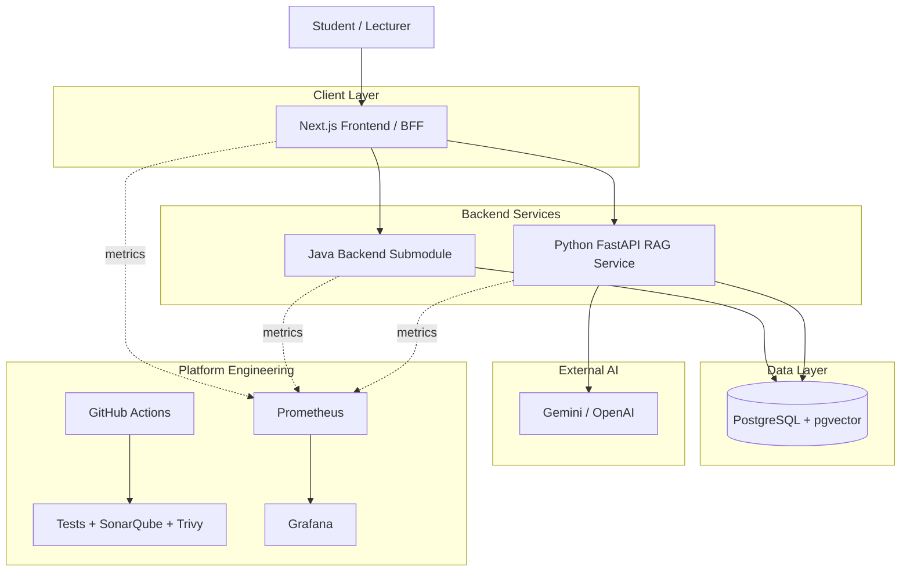

# SWD392 Course Document Chatbot

This repository contains the architecture, documentation, and future service
workspace for the SWD392 Course Document Chatbot.

The current phase is **architecture and planning**, not application
implementation. The project is designed as a production-like learning system so
the team can practice microservice boundaries, RAG design, CI/CD, security
scanning, and observability without overbuilding the first version.

## Start Here

Read the [Architecture Handbook](docs/architecture/README.md) first.

Recommended order:

1. [Architecture Handbook](docs/architecture/README.md)
2. [C4 Diagrams](docs/architecture/c4-diagrams.md)
3. [Backend Microservices](docs/architecture/backend-microservices.md)
4. [RAG and Data Architecture](docs/architecture/rag-and-data.md)
5. [DevSecOps](docs/architecture/devsecops.md)
6. [Observability](docs/architecture/observability.md)
7. [Deployment Roadmap](docs/architecture/deployment-roadmap.md)

## Target Architecture

## Repository Layout

| Path | Purpose |
| --- | --- |
| `docs/architecture/` | Architecture handbook, diagrams, DevSecOps, observability, and ADRs |
| `docs/swd392-chatbot-user-stories.md` | Product stories and acceptance criteria |
| `docs/embeddings/` | Embedding and retrieval reference material |
| `services/nextjs-frontend/` | Future Next.js frontend workspace |
| `services/java-backend/` | Future integration point for the Java backend submodule |
| `services/python-backend/` | Future Python FastAPI RAG service workspace |
| `infra/` | Future infrastructure documentation and IaC |
| `scripts/` | Future helper scripts for setup, seed data, and tests |

## Current Decisions

| Area | Decision |
| --- | --- |
| Frontend | Next.js BFF |
| Backend | Pragmatic microservice architecture |
| Java backend | External Git submodule integrated through API contracts |
| RAG backend | Python FastAPI |
| Vector store | PostgreSQL + pgvector |
| Local workflow | Docker Compose first |
| Kubernetes | Future deployment model, not implemented now |
| CI/CD | GitHub Actions first; Jenkins is an alternative |
| Quality | SonarQube quality gate |
| Security | Trivy scans |
| Observability | Prometheus and Grafana |

## Local Development Note

The existing `docker-compose.yml` is an early skeleton. Before application
implementation starts, it should be aligned with the architecture handbook,
especially the PostgreSQL + pgvector decision and the external Java submodule
workflow.
