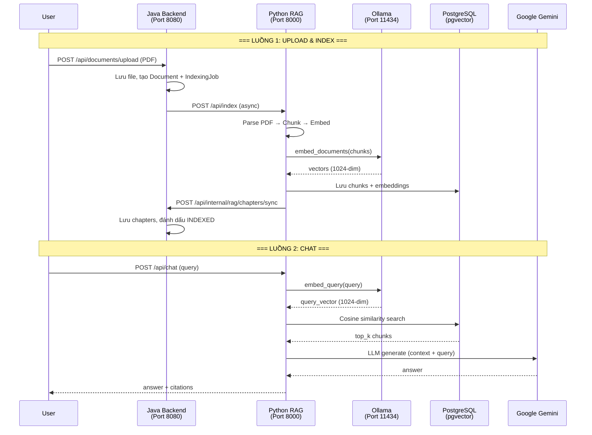

# RAG Pipeline — Chi tiết Flow xử lý

Tài liệu mô tả chi tiết luồng xử lý RAG (Retrieval-Augmented Generation) giữa Java Backend và Python RAG Backend.

---

## Tổng quan kiến trúc



---

## Luồng 1: Upload & Indexing

### Bước 1 — Upload Document (Java)

| Thuộc tính | Giá trị |
|-----------|---------|
| **Endpoint** | `POST /api/documents/upload` |
| **File** | `DocumentController.java` → `DocumentServiceImpl.java` |
| **Input** | `DocumentUploadRequest { courseId: UUID, file: MultipartFile }` |
| **Output** | `DocumentResponse { id, status: UPLOADED, ... }` |

**Chi tiết xử lý:**

```
DocumentController.uploadDocument()
  └── DocumentServiceImpl.uploadDocument()
        ├── courseRepository.findById(courseId)           // Validate course tồn tại
        ├── Kiểm tra trùng filename trong course
        │     ├── Có → Xóa file cũ, upload file mới, cập nhật metadata
        │     └── Không → Upload file mới, tạo Document mới
        ├── storageService.uploadFile(file)               // Lưu PDF vào disk
        │     └── Trả về relative path: "uploads/documents/UUID_filename.pdf"
        ├── documentRepository.save(document)
        └── ragIntegrationService.triggerIndexing(docId, storagePath)
```

---

### Bước 2 — Trigger Indexing (Java → Python)

| Thuộc tính | Giá trị |
|-----------|---------|
| **File** | `RagIntegrationServiceImpl.java` → `RagApiClient.java` |
| **Input** | `documentId: UUID, storagePath: String` |
| **Output** | Tạo `IndexingJob` với status `PROCESSING` |

**Chi tiết xử lý:**

```
RagIntegrationServiceImpl.triggerIndexing()
  ├── indexingJobRepository.countByDocumentId(docId)    // Đếm attempt bằng COUNT query
  ├── Tạo IndexingJob { status: PROCESSING, attemptNumber }
  ├── document.markProcessing()
  └── ragApiClient.sendIndexingRequestAsync()           // @Async HTTP POST
        └── POST http://localhost:8000/api/index
              Body: { documentId, jobId, storagePath }
```

---

### Bước 3 — Parse PDF (Python)

| Thuộc tính | Giá trị |
|-----------|---------|
| **Endpoint** | `POST /api/index` |
| **File** | `routers/indexer.py` → `services/document_parser.py` |
| **Input** | `IndexRequest { documentId, jobId, storagePath }` |
| **Output** | `(full_text: str, chapters_info: list[dict], pages_info: list[dict])` |

**Chi tiết xử lý:**

```
indexer.index_document()
  └── indexing_task() [BackgroundTask]
        └── DocumentParser.parse_pdf(file_path)
              ├── fitz.open(file_path)                     // PyMuPDF mở PDF
              ├── Lặp qua từng trang:
              │     ├── page.get_text("text")               // Trích xuất text
              │     └── Gom vào full_text + pages_info
              ├── doc.get_toc()                             // Đọc Mục Lục PDF
              │     ├── Có TOC → Lọc chỉ Level 1 (chương chính)
              │     │     └── chapters_info = [{ title, orderIndex, startPage, description }]
              │     └── Không có TOC → chapters_info = [{ title: "Document Content" }]
              └── return (full_text, chapters_info, pages_info)
```

**Ví dụ output `chapters_info`:**
```json
[
  { "title": "Chapter 1: Introduction", "orderIndex": 1, "startPage": 1 },
  { "title": "Chapter 2: Overview of UML", "orderIndex": 2, "startPage": 15 }
]
```

---

### Bước 4 — Semantic Chunking (Python)

| Thuộc tính | Giá trị |
|-----------|---------|
| **File** | `services/chunking.py` |
| **Input** | `full_text: str` |
| **Output** | `list[str]` (danh sách các chunk văn bản) |

**Chi tiết xử lý:**

```
chunk_document(full_text)
  ├── OllamaEmbeddings(model=settings.embedding_model)   // qwen3-embedding:0.6b
  ├── SemanticChunker(embeddings, breakpoint_threshold=0.85)
  └── text_splitter.split_text(full_text)
        └── Tách văn bản theo ngữ nghĩa (không phải cố định 500 ký tự)
            Mỗi chunk chứa các câu liên quan về mặt ngữ nghĩa
```

**Ví dụ:** Một tài liệu 50 trang có thể tạo ra 30-80 chunks tùy vào cấu trúc nội dung.

---

### Bước 5 — Embedding & Store (Python)

| Thuộc tính | Giá trị |
|-----------|---------|
| **File** | `services/embedding.py` |
| **Input** | `db, document_id, chunks, pages_info, chapters_info` |
| **Output** | Dữ liệu được lưu vào 2 bảng: `document_chunks` + `chunk_embeddings` |

**Chi tiết xử lý:**

```
process_and_store_chunks()
  ├── OllamaEmbeddings.embed_documents(chunks)     // Gọi Ollama batch embed
  │     └── Trả về: list[list[float]] (mỗi vector 1024 chiều)
  │
  ├── Xóa dữ liệu cũ (nếu re-index):
  │     ├── DELETE chunk_embeddings WHERE chunk_id IN (SELECT id FROM document_chunks WHERE doc_id = ...)
  │     └── DELETE document_chunks WHERE document_id = ...
  │
  └── Lặp qua từng chunk:
        ├── Xác định page_num: So sánh 50 ký tự đầu chunk với text từng trang
        ├── Xác định chapter_title: Dựa vào page_num → tìm chapter có startPage <= page_num
        ├── Tạo DocumentChunk { document_id, chunk_index, content, token_count, metadata }
        │     └── metadata = { "page_num": 5, "chapter_title": "Chapter 2: Overview" }
        └── Tạo ChunkEmbedding { chunk_id, embedding: vector(1024), model_name }
```

**Schema Database:**

```
document_chunks                    chunk_embeddings
├── id (UUID, PK)                  ├── chunk_id (UUID, PK, FK)
├── document_id (UUID, FK)         ├── embedding (vector(1024))
├── chunk_index (int)              ├── model_name (varchar)
├── content (text)                 └── created_at (timestamp)
├── token_count (int)
├── metadata (jsonb)
└── created_at (timestamp)
```

---

### Bước 6 — Webhook → Java (Python → Java)

| Thuộc tính | Giá trị |
|-----------|---------|
| **File** | `services/webhook.py` |
| **Input** | `document_id, job_id, chapters_info, chunk_count` |
| **Output** | HTTP 200 từ Java |

**Chi tiết xử lý:**

```
sync_chapters_to_java()
  └── POST http://localhost:8080/api/internal/rag/chapters/sync
        Body: {
          "documentId": "uuid",
          "jobId": "uuid",
          "chapters": [{ "title": "...", "orderIndex": 1, "description": "..." }],
          "chunkCount": 45
        }
```

**Java nhận webhook:**

```
RagWebhookController.syncChapters()
  └── ChapterServiceImpl.syncChaptersFromRag()
        ├── chapterRepository.deleteByDocumentId(docId)    // Xóa chapters cũ (JPQL)
        ├── Tạo + lưu chapters mới từ request
        ├── document.markIndexed(chunkCount)                // Cập nhật status + chunk_count
        └── job.setStatus(INDEXED)                          // Đánh dấu job thành công
```

---

### Bước 6b — Xử lý lỗi (nếu indexing thất bại)

```
# Python gửi khi xảy ra exception
notify_failure_to_java()
  └── POST http://localhost:8080/api/internal/rag/failed
        Body: { "documentId": "uuid", "jobId": "uuid", "error": "error message" }

# Java nhận
RagIntegrationServiceImpl.handleIndexingFailure()
  ├── job.setStatus(FAILED)
  └── document.markFailed(errorMessage)
```

---

## Luồng 2: Chat (RAG Retrieval)

### Bước 1 — Nhận câu hỏi & Embed query

| Thuộc tính | Giá trị |
|-----------|---------|
| **Endpoint** | `POST /api/chat` |
| **File** | `routers/chat.py` |
| **Input** | `ChatRequest { document_id, query, chapter_title?, top_k? }` |

```
chat_with_document()
  ├── Kiểm tra GEMINI_API_KEY
  └── OllamaEmbeddings.embed_query(req.query)
        └── Trả về: list[float] (vector 1024 chiều cho câu hỏi)
```

---

### Bước 2 — Vector Search (pgvector)

```
  ├── SELECT document_chunks.*, cosine_distance(embedding, query_vector) AS distance
  │   FROM document_chunks
  │   JOIN chunk_embeddings ON chunk_id = document_chunks.id
  │   WHERE document_id = :doc_id
  │   [AND metadata->>'chapter_title' = :chapter_title]     // Lọc theo chương (optional)
  │   ORDER BY distance ASC
  │   LIMIT :top_k
  │
  └── Trả về: list[(DocumentChunk, distance)]
```

---

### Bước 3 — Gọi LLM & Trả về kết quả

```
  ├── Gom nội dung các chunk thành context_block
  ├── Tạo prompt: "You are a helpful assistant... Context: {context} Question: {query}"
  ├── ChatGoogleGenerativeAI.invoke(prompt)
  │     └── Model: settings.llm_model (mặc định: gemini-3.1-flash-lite)
  ├── Xử lý response (list → string nếu cần)
  └── return ChatResponse {
        "answer": "Câu trả lời từ LLM",
        "citations": [
          { "chunk_index": 3, "page_num": 5, "distance": 0.234 },
          { "chunk_index": 7, "page_num": 12, "distance": 0.312 }
        ]
      }
```

**Output mẫu:**
```json
{
  "answer": "UML (Unified Modeling Language) là một ngôn ngữ mô hình hóa tiêu chuẩn...",
  "citations": [
    { "chunk_index": 5, "page_num": 18, "distance": 0.1823 },
    { "chunk_index": 12, "page_num": 25, "distance": 0.2451 }
  ]
}
```

---

## Sơ đồ Database

```mermaid
erDiagram
    documents ||--o{ chapters : has
    documents ||--o{ indexing_jobs : has
    documents ||--o{ document_chunks : has
    document_chunks ||--|| chunk_embeddings : has

    documents {
        UUID id PK
        UUID course_id FK
        UUID uploaded_by FK
        string original_filename
        string storage_path
        enum status "UPLOADED|PROCESSING|INDEXED|FAILED"
        int chunk_count
        timestamp indexed_at
    }

    chapters {
        UUID id PK
        UUID document_id FK
        short order_index
        string title
        text description
    }

    indexing_jobs {
        UUID id PK
        UUID document_id FK
        enum status
        text error_message
        short attempt_number
        timestamp started_at
        timestamp completed_at
    }

    document_chunks {
        UUID id PK
        UUID document_id FK
        int chunk_index
        text content
        int token_count
        jsonb metadata
    }

    chunk_embeddings {
        UUID chunk_id PK_FK
        vector_1024 embedding
        string model_name
    }
```

---

## Cấu hình Model (config.py)

Tất cả model names được quản lý tập trung tại `rag-backend/core/config.py`:

| Biến | Mặc định | Mô tả |
|------|---------|-------|
| `EMBEDDING_MODEL` | `qwen3-embedding:0.6b` | Model embedding chạy local qua Ollama |
| `LLM_MODEL` | `gemini-3.1-flash-lite` | Model LLM cho chat (Google Gemini) |
| `OLLAMA_BASE_URL` | `http://localhost:11434` | URL server Ollama |
| `GEMINI_API_KEY` | *(từ .env)* | API key Google AI Studio |

Đổi model chỉ cần sửa `.env`, không cần sửa code.
