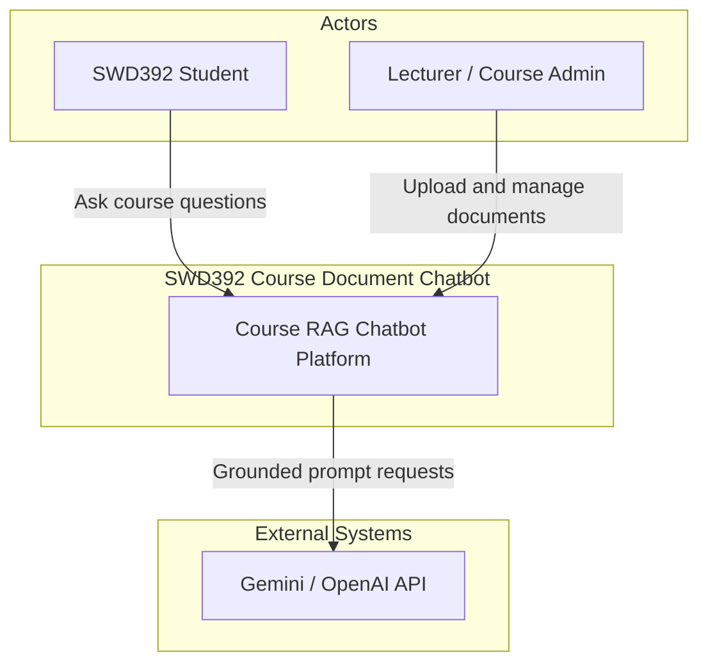
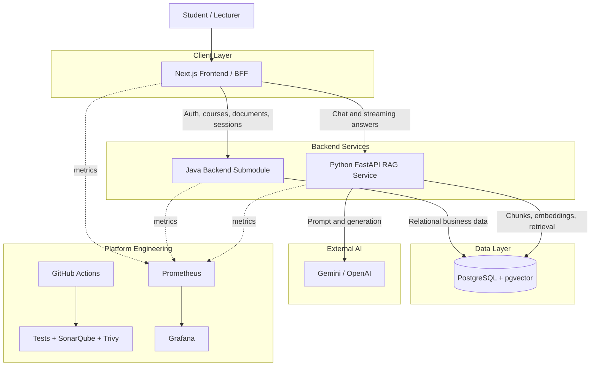
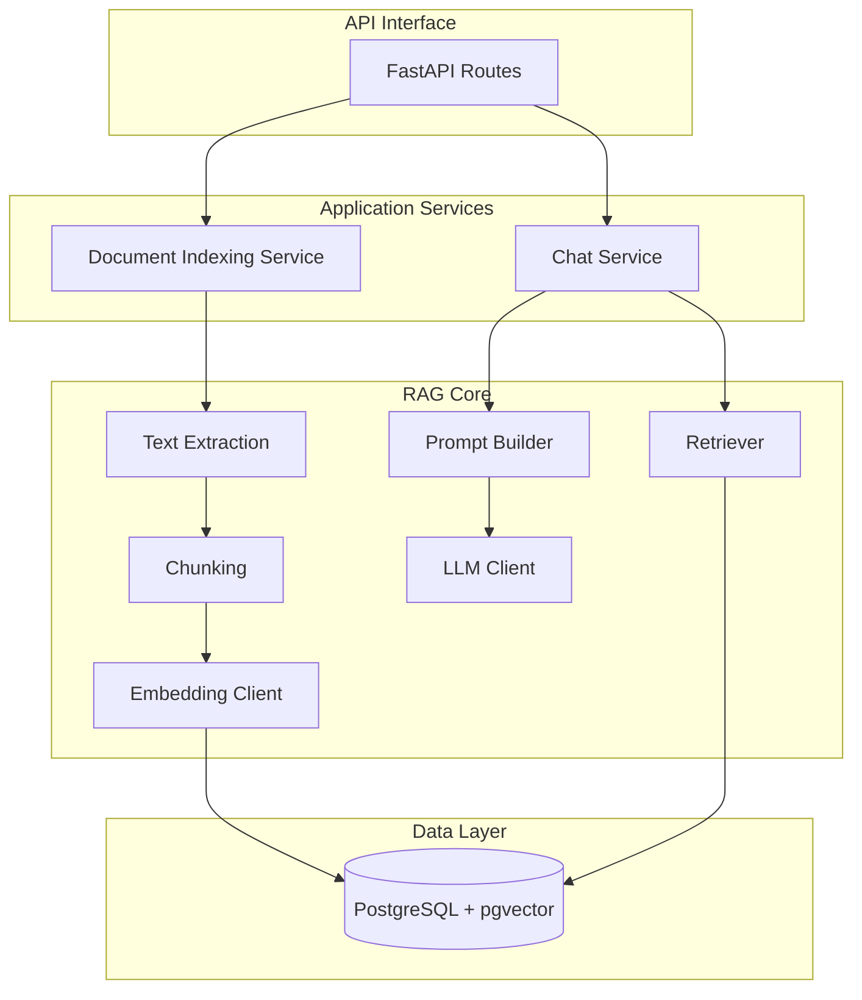
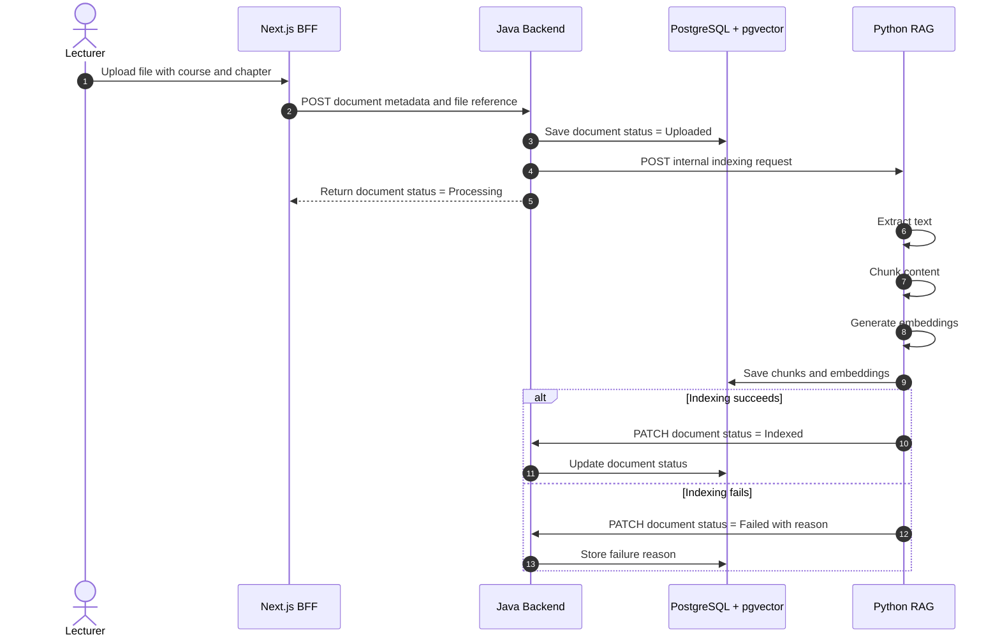
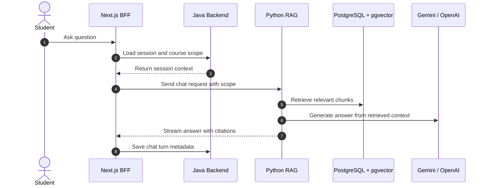
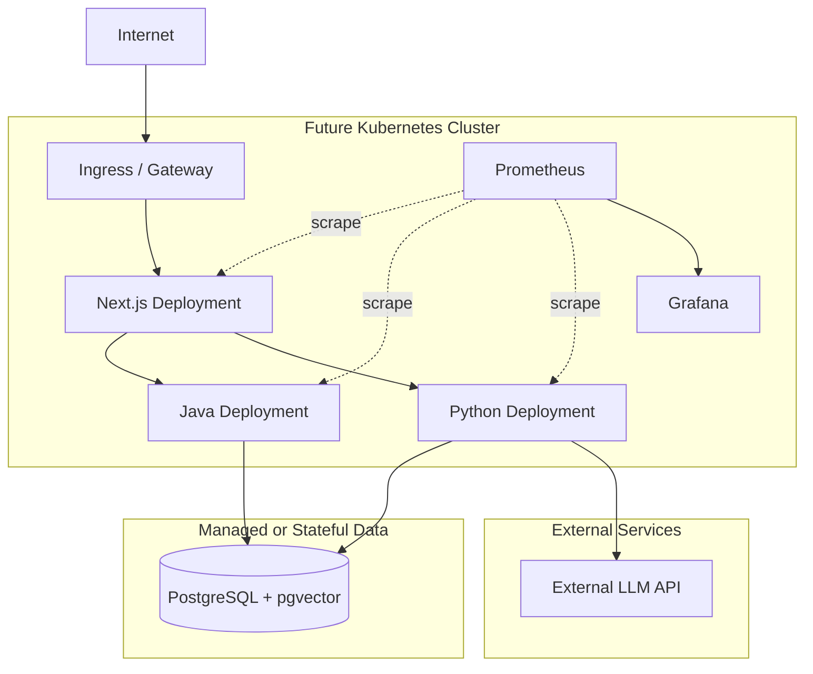

# C4 Architecture Diagrams

These diagrams use the C4 idea: start broad, then zoom into containers,
components, and runtime flows. They are intentionally written in Mermaid so the
team can review them directly in Markdown.

## Level 1: System Context

## Level 2: Containers

## Level 3: Python RAG Components

## Dynamic View: Document Ingestion

## Dynamic View: Chat

## Future Deployment View

Kubernetes is a future deployment model, not an immediate implementation
requirement.

