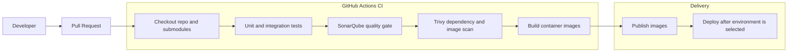

# DevSecOps Reference Architecture

The default CI/CD design is GitHub Actions first. Jenkins is documented as an
enterprise alternative, not a required tool for the current phase.

## Recommended Pipeline

## GitHub Actions First

Use GitHub Actions because:

- The source code and Java submodule are GitHub-based.
- Pull request checks are visible where code review happens.
- It is easier for a course team to operate than a separate Jenkins server.
- It can still run production-like stages: tests, quality gates, scans, builds,
  and deployment jobs.

## Jenkins Alternative

Use Jenkins only if the team has a specific learning or infrastructure reason.
If selected later, Jenkins should run the same logical stages:

- Checkout repository and submodules.
- Run frontend, Java, and Python tests.
- Run SonarQube analysis.
- Run Trivy scans.
- Build and publish container images.
- Deploy to the chosen environment.

Do not maintain GitHub Actions and Jenkins as equal production pipelines unless
there is a strong reason. Duplicate pipelines drift quickly.

## SonarQube

SonarQube should be used as a quality gate for maintainability and reliability.
The initial quality gate should focus on:

- No blocker or critical issues on new code.
- Test coverage trend visible on new code.
- Duplication visible on new code.
- Pull requests blocked when the quality gate fails.

## Trivy

Trivy should scan:

- Dependency vulnerabilities.
- Container image vulnerabilities.
- Infrastructure-as-Code issues when Kubernetes or Terraform files are added.
- Secret leaks if enabled in the pipeline.

High and critical vulnerabilities should fail the pipeline unless the team has a
documented exception.

## Container Image Policy

When implementation starts, each deployable service should produce its own image:

- `swd392-frontend`
- `swd392-java-backend`
- `swd392-python-rag`

Images should be tagged with both the Git commit SHA and a human-readable
version or environment tag.

## Release Strategy

Use staged maturity:

1. Local development with Docker Compose.
2. Pull request checks with tests, SonarQube, and Trivy.
3. Container image build and publish.
4. Deployment automation after the target environment is selected.
