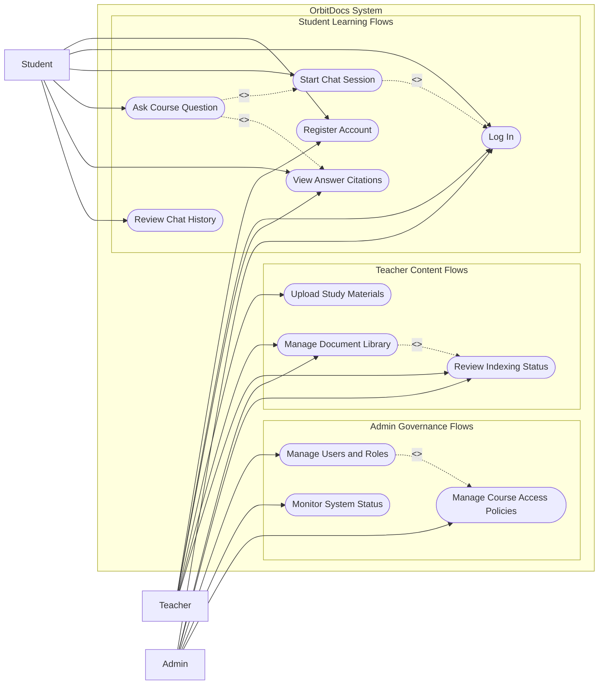

# SWD392 Use Case Diagram

This document provides a system-level use case view for the SWD392 OrbitDocs
platform. It focuses on the main interactions of the three agreed actors:
Student, Teacher, and Admin.

## Scope

The diagram covers the current product direction shown across the architecture
handbook, user stories, and frontend prototype:

- Students use the chatbot to ask course questions and review cited answers.
- Teachers upload and manage study materials that feed the chatbot knowledge
  base.
- Admins control user access, course governance, and operational visibility.

## Assumptions

- `Teacher` represents a lecturer or course staff member who manages SWD392
  study materials.
- `Admin` represents a platform or course administrator role. This role is
  included for governance and operations, even though it is not yet specified
  in the same detail as Student and Teacher stories.
- Authentication is modeled as a shared use case because all actors must enter
  the system before protected actions.

## System-Level Use Case Diagram

## Actor Summary

### Student

The Student is the primary learning actor. This actor logs in, starts a chat
session, asks questions about SWD392 materials, reviews citations, and reopens
previous chat history for study continuity.

### Teacher

The Teacher is the content management actor. This actor uploads study
materials, maintains the document library, and reviews indexing status to make
sure students receive answers from approved sources.

### Admin

The Admin is the governance and operations actor. This actor manages roles and
access rules, monitors system health, and can review the document library and
indexing state for operational control.

## Notes

- `Ask Course Question` includes `View Answer Citations` because cited answers
  are part of the core product promise.
- `Manage Document Library` includes `Review Indexing Status` because document
  management depends on knowing whether materials are uploaded, processing,
  indexed, or failed.
- This diagram is intentionally system-level. Detailed textual use cases can be
  added later for Student, Teacher, and Admin flows if the team wants a deeper
  UML analysis.
