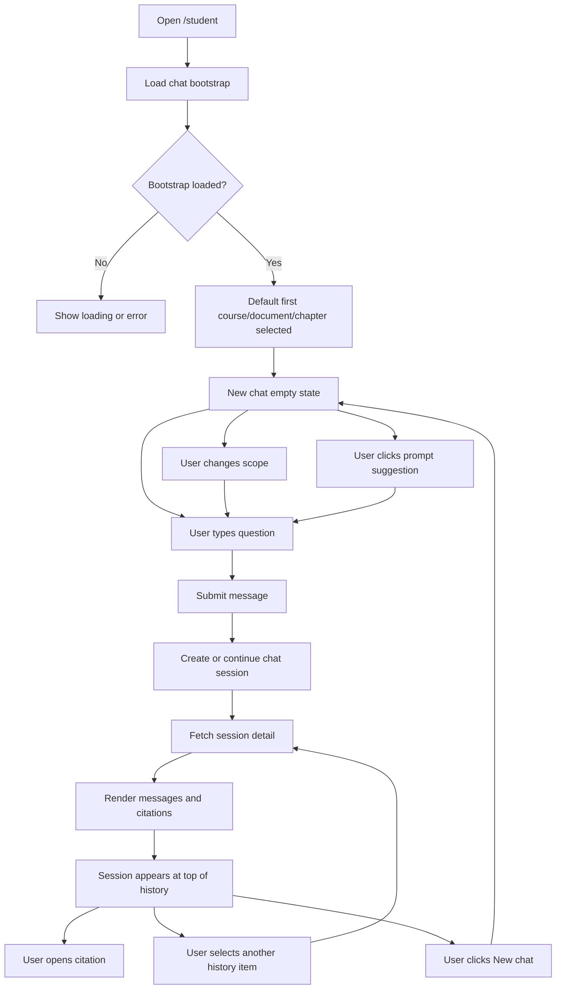

# OrbitDocs Dashboard Redesign Brief for OpenDesign

Date: 2026-06-22
Scope: dashboard-first UI redesign
Goal: redesign the interface and screenflow while preserving existing routes, data behavior, role logic, and API-backed workflows.

## Product Context

OrbitDocs is a course document and RAG chat workspace. The UI has three authenticated workspaces:

- Student workspace at `/student`: chat with course documents, select course/document/chapter scope, browse saved chat history, inspect citations, and submit prompts.
- Lecturer workspace at `/teacher`: see assigned courses, document indexing status, chat readiness, recent documents, and links to course/document management.
- Admin workspace at `/admin`: manage users, courses, and roles, plus monitor basic system metrics.

The redesign must keep all current logic intact. Do not invent new backend capabilities. Design new screens around existing states and actions.

## Screen Inventory

### Student Dashboard: `/student`

This is the first screen to redesign. It is currently a chat workspace, not a classic metric dashboard.

Core UI regions:

1. Left sidebar on desktop, bottom/sheet navigation on mobile.
2. OrbitDocs brand block.
3. New chat action.
4. Scope picker with course, document, and chapter controls.
5. Conversation history search.
6. Conversation history list.
7. User account menu with password settings, logout, and lecturer workspace link when the signed-in user is a lecturer.
8. Chat top bar with current session title.
9. Empty chat landing state with prompt suggestions.
10. Message thread with user/assistant messages.
11. Citation chips/popovers attached to assistant replies.
12. Composer with scope label, multiline input, and submit button.
13. Loading, submitting, disabled, empty, and error states.

### Lecturer Dashboard: `/teacher`

Keep this as an operational overview for lecturers.

Current content:

- Header with lecturer welcome and refresh workspace action.
- Summary metrics: courses, documents, failures, chat-ready courses.
- Workspace modules: courses, knowledge base, student chat.
- Chat readiness list.
- Recent documents list with document status.
- Assigned courses list.
- Primary actions: upload documents, open chat workspace.

### Admin Dashboard: `/admin`

Keep this as an admin governance overview.

Current content:

- Header with system dashboard title and health badge.
- Metrics row: total users, active roles, active courses.
- User growth chart area.
- Quick actions: add user, create course, manage roles.
- Governance module cards: users, courses, roles.

## Primary OpenDesign Prompt: Student Dashboard

Design a dashboard screen for OrbitDocs, a document chat platform. The screen is the authenticated student workspace at `/student`. It should preserve the existing logic: users select a course, document, and optional chapter; start a new chat; search previous conversations; open an existing chat session; ask questions; receive answers with citations; and manage their account.

Create a desktop layout with a fixed left workspace sidebar and a main chat panel. The left sidebar should include a compact OrbitDocs brand header, a prominent "New chat" button, course/document/chapter scope controls, a chat-history search field, a scrollable conversation list, and a compact user account menu at the bottom. The main panel should include a top bar with the active session title, an empty state for new chats, a message thread state, citation chips, and a bottom composer.

Desktop layout requirements:

- App canvas: full viewport, light neutral background.
- Sidebar: around 300-330px wide, persistent on large screens.
- Main panel: flexible chat workspace, with a clear top bar and large message area.
- Composer: sticky at bottom of main panel, with visible active scope.
- Message bubbles: assistant messages left, user messages right, readable max width, citation chips under assistant replies.
- Empty state: centered but compact, showing active scope and 3 prompt suggestions.
- Conversation history items: show title, course name, and last message time.
- Active history item should be visibly selected.

Mobile layout requirements:

- Sidebar becomes a slide-over sheet opened from a menu button.
- Main chat remains the first screen.
- Composer stays reachable at bottom.
- Scope picker remains inside the sheet to avoid crowding the chat.
- Text and controls must not overflow on small screens.

## Student Dashboard States

Design these states explicitly:

1. Loading bootstrap data
   - Show skeleton or compact loading indicator for scope controls/history and chat area.

2. New chat empty state
   - No messages yet.
   - Show short prompt: "What should we explore?"
   - Show active scope.
   - Show prompt suggestion chips.

3. Active conversation
   - Show message timeline.
   - User messages align right.
   - Assistant messages align left.
   - Assistant messages can include citation chips.
   - Clicking a citation opens a popover/detail panel with source label and snippet.

4. Sending message
   - Disable composer.
   - Submit button shows sending/loading state.
   - Preserve entered context and active session.

5. No saved chats
   - Sidebar history area shows an empty dashed/quiet state.

6. Scope unavailable
   - Course/document selectors can be disabled.
   - Composer disabled until a valid scope or active session exists.

7. Error state
   - Use a concise alert above the chat panel.
   - Keep retry/navigation available.

## Student Screenflow

## Lecturer Dashboard Prompt

Design the lecturer dashboard as a compact operational command center for managing course document readiness. Preserve all existing actions and data:

- Refresh workspace.
- View assigned course count.
- View total/indexed/processing/failed document counts.
- View chat-ready course count.
- Navigate to courses.
- Navigate to knowledge base.
- Open student chat workspace.
- See chat-ready courses.
- See recent documents and their statuses.
- See assigned course list.
- Upload documents.

The layout should prioritize status scanning. Use a top header, metric row, two-column operational section, recent documents table/list, assigned courses list, and action buttons. Keep the lecturer shell navigation on the left for desktop and compact top navigation for mobile.

## Admin Dashboard Prompt

Design the admin dashboard as a governance and system overview. Preserve current navigation and actions:

- Users management.
- Course catalog.
- Role governance.
- System health indicator.
- Metrics cards.
- User growth chart.
- Quick action links.

Keep the page information-dense and role-specific.

## Cross-Screen Navigation Rules

Authenticated role routing must remain unchanged:

- Student home: `/student`
- Lecturer home: `/teacher`
- Admin home: `/admin`
- Password settings: `/settings/password`
- Lecturer can open student chat from `/teacher` and from the account menu in `/student`.
- Logout remains in the account/user action menu.

Do not add new top-level routes unless the implementation later explicitly supports them.

## Components to Preserve Conceptually

The redesign can change visuals, spacing, and grouping, but must keep these conceptual components:

- App shell and role navigation.
- Account/user action menu.
- New chat button.
- Course selector.
- Document selector.
- Chapter selector with "All chapters".
- Chat history search.
- Chat history list.
- Empty chat prompt suggestions.
- Message list.
- Citation popover/detail.
- Chat composer.
- Lecturer metric cards.
- Lecturer readiness/recent document sections.
- Admin metrics, quick actions, and module links.

## Acceptance Checklist for OpenDesign Output

- The `/student` dashboard is designed first and in the most detail.
- The design clearly supports desktop and mobile.
- The student dashboard still works as a chat workspace, not a generic analytics dashboard.
- Course/document/chapter scoping is visible before starting a new chat.
- The composer shows the active scope.
- Citation handling is represented.
- Empty, loading, error, disabled, and sending states are represented.
- Lecturer and admin dashboards use the same design system but remain role-specific.
- No backend, route, auth, or business logic changes are implied.
