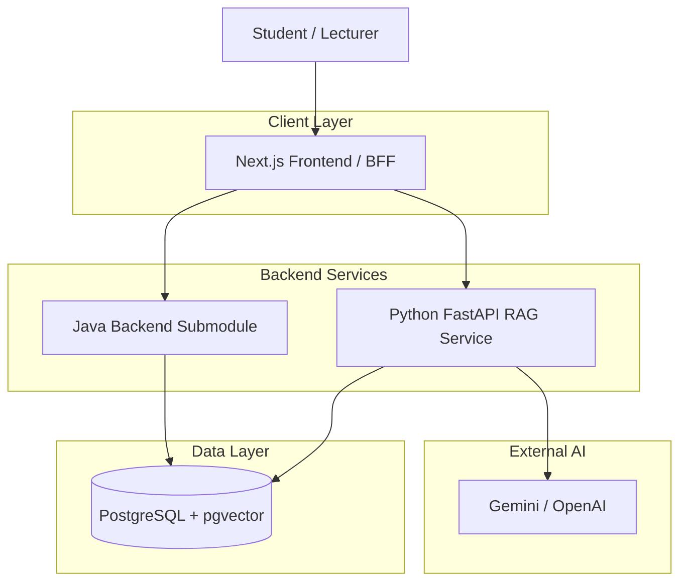

# System Architecture

The canonical architecture documentation now lives in the
[Architecture Handbook](../architecture/README.md).

Use this file as a short entry point for the high-level system shape.

## Overview

The SWD392 Course Document Chatbot is a production-like learning system with:

- A Next.js frontend that also acts as a Backend-for-Frontend (BFF).
- A Java backend, integrated as an external Git submodule, for business data and
  API contracts.
- A Python FastAPI backend for RAG ingestion, retrieval, prompt construction,
  and LLM calls.
- PostgreSQL + pgvector as the target relational and vector store.
- GitHub Actions, SonarQube, Trivy, Prometheus, and Grafana as the reference
  DevSecOps and observability toolchain.

## Main Documents

- [C4 Diagrams](../architecture/c4-diagrams.md)
- [Backend Microservices](../architecture/backend-microservices.md)
- [RAG and Data Architecture](../architecture/rag-and-data.md)
- [DevSecOps](../architecture/devsecops.md)
- [Observability](../architecture/observability.md)
- [Deployment Roadmap](../architecture/deployment-roadmap.md)
