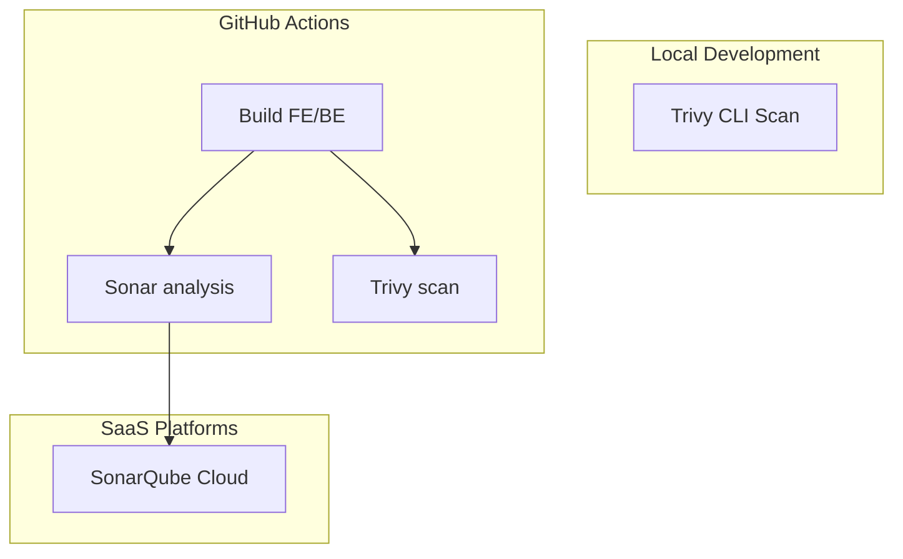
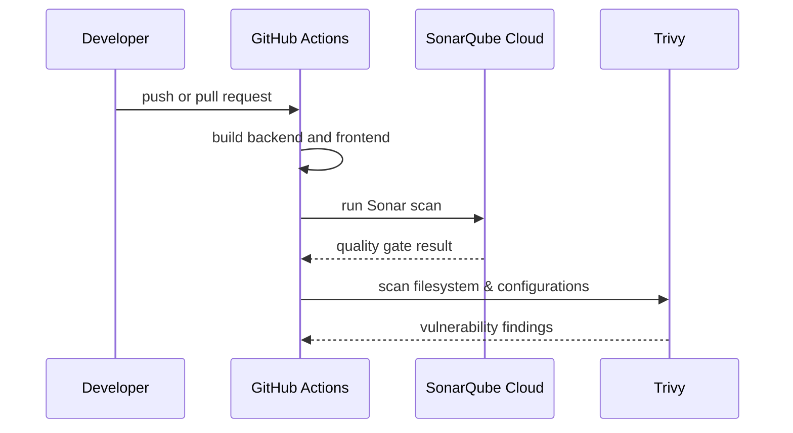

# DevSecOps Security Tooling


This folder contains documentation and scanning policies for the security verification pipeline in the `SWD392` project.

## Folder Structure

```text
security/
  ├── SETUP.md                 # Setup guide for SonarCloud secrets and local Trivy
  ├── HARDENING.md             # Security checklists and best practices
  ├── README.md                # This file
  ├── sonarqube/
  │   ├── README.md            # SonarQube Cloud credentials and CLI execution
  │   └── sonar-project.properties.example
  └── trivy/
      ├── README.md            # Trivy command-line instruction guide
      └── trivy.yaml.example   # Trivy configuration settings
```

## Architecture



## Workflow



## CI/CD Pipeline Policy

A pipeline run is only successful if the following checks pass:

| Gate | Target | Policy |
|---|---|---|
| Build | Frontend, OrbitDocs-backend | Code compiles with no errors. |
| SonarQube | Source Directories | Quality Gate is computed on SonarCloud and returns PASS. |
| Trivy | Repository Filesystem | No unapproved HIGH or CRITICAL findings. |
| Trivy | Config & IaC | No unapproved configuration misconfigurations. |

For detailed scanner execution guides:
- See [sonarqube/README.md](./sonarqube/README.md) for SonarCloud project tokens and parameters.
- See [trivy/README.md](./trivy/README.md) for local file scan policies.
