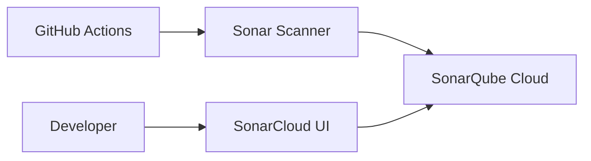

# SonarQube Cloud Setup


SonarQube Cloud (SonarCloud) is the repository's code-quality gate platform.

## Architecture



## Setup & Configuration

### 1. Generating a Token
To authenticate your scans, generate a SonarCloud token:
1. Log in to [SonarCloud](https://sonarcloud.io/).
2. Navigate to your account settings by clicking your profile avatar in the top-right corner.
3. Select **My Account > Security**.
4. In the **Tokens** section, enter a name (e.g. `github-actions`) and click **Generate Token**.
5. Copy the generated token. Store it in your GitHub repository secrets as `SONAR_TOKEN`.

### 2. GitHub Secrets & Variables
Set up the following variables in your GitHub Repository settings (**Settings > Secrets and variables > Actions**):

- **Repository Secret**:
  - `SONAR_TOKEN`: (Your SonarCloud token)
- **Repository Variables**:
  - `SONAR_ORGANIZATION`: (Your SonarCloud organization key)
  - `SONAR_PROJECT_KEY`: (Your SonarCloud project key)
  - `SONAR_HOST_URL`: `https://sonarcloud.io`

---

## Scanning Locally

To run code quality scans from your local machine, ensure you have the `sonar-scanner` tool or Maven plugins installed.

### 1. Java Backend Scan (OrbitDocs-backend)

Run the Sonar scan locally using Maven:

```bash
cd OrbitDocs-backend
./mvnw clean compile
./mvnw sonar:sonar \
  -Dsonar.organization=<your-sonarcloud-org> \
  -Dsonar.projectKey=<your-sonarcloud-project> \
  -Dsonar.host.url=https://sonarcloud.io \
  -Dsonar.login=<your-sonarcloud-token>
```

### 2. Full Project Scan (including Frontend and Python)

Install the standalone `sonar-scanner` CLI tool, and run the command from the root of the repository:

```bash
sonar-scanner \
  -Dsonar.organization=<your-sonarcloud-org> \
  -Dsonar.projectKey=<your-sonarcloud-project> \
  -Dsonar.host.url=https://sonarcloud.io \
  -Dsonar.login=<your-sonarcloud-token>
```

The scan automatically respects boundaries defined in `sonar-project.properties`.

## Why `sonar-project.properties` is at the repo root

The active scanner reads
[`sonar-project.properties`](/Users/Southern/Learn/SUMMER2026/SWD392/sonar-project.properties)
from the repository root by default. That file is live CI configuration, so it
belongs at the root next to the GitHub workflow.

The copy in
[`security/sonarqube/sonar-project.properties.example`](/Users/Southern/Learn/SUMMER2026/SWD392/security/sonarqube/sonar-project.properties.example)
is only a documented example for the DevOps structure, not the file GitHub
Actions executes.
