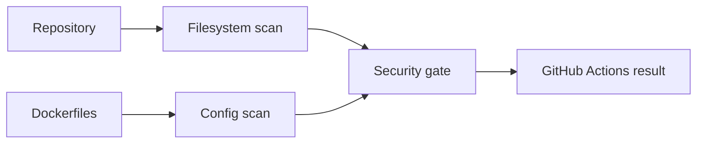

# Trivy Setup


Trivy scans filesystems, dependency manifests, and infrastructure configurations (such as Dockerfiles) for security vulnerabilities and misconfigurations.

## Workflow



## Scan Policies

Local scan configurations default to:
- `security/trivy/trivy.yaml.example`

In our CI pipeline, we enforce the following rules:

| Scan Type | Target | Severity | Exit Code | Action |
|---|---|---|---|---|
| Filesystem (`fs`) | Source tree & libraries | `HIGH,CRITICAL` | `1` | Fails build if found |
| Configuration (`config`) | Dockerfiles, YAML files | `HIGH,CRITICAL` | `1` | Fails build if found |

## Installation

### macOS (Homebrew)

```bash
brew install aquasecurity/trivy/trivy
```

### Linux (Ubuntu/Debian)

```bash
sudo apt-get update
sudo apt-get install -y wget apt-transport-https gnupg lsb-release
wget -qO - https://aquasecurity.github.io/trivy-repo/deb/public.key | sudo gpg --dearmor -o /usr/share/keyrings/trivy.gpg
echo "deb [signed-by=/usr/share/keyrings/trivy.gpg] https://aquasecurity.github.io/trivy-repo/deb $(lsb_release -sc) main" | sudo tee /etc/apt/sources.list.d/trivy.list
sudo apt-get update
sudo apt-get install -y trivy
```

### Run via Docker

If you do not wish to install Trivy locally, you can run it via Docker:

```bash
docker run --rm -v $(pwd):/workspace -w /workspace aquasec/trivy:latest fs .
```

## Running Local Scans

Run these commands from the repository root:

### 1. Filesystem & Dependency Scan
```bash
trivy fs --severity HIGH,CRITICAL --exit-code 1 .
```

### 2. Configuration & Misconfig Scan
```bash
trivy config --severity HIGH,CRITICAL --exit-code 1 .
```

## Triage & Exclusions
- Do not check in `.trivyignore` files unless there is an approved architectural exception.
- Review and upgrade package versions when vulnerable transitive dependencies are flagged.
